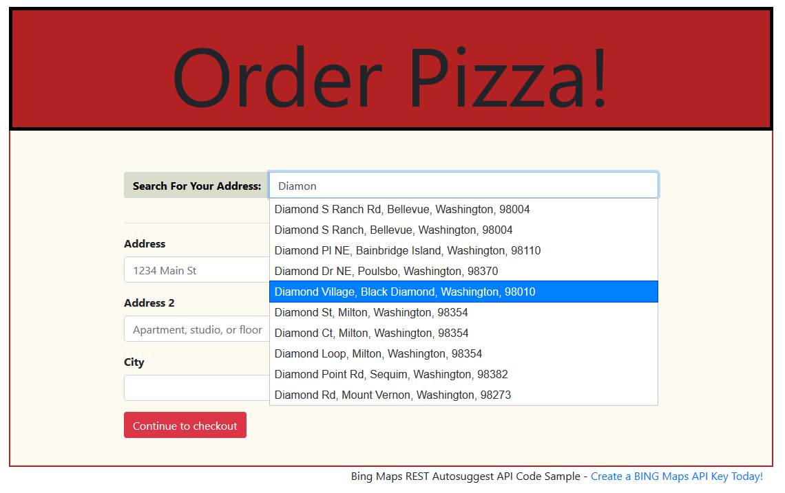

# Bing Maps Autosuggest API Samples

This repo contains several Javascript samples utilizing the new [Bing Maps REST API](https://msdn.microsoft.com/en-us/library/ff701713.aspx) service: Autosuggest API.

## Autosuggest Address for Online Ordering Form

The [pizza ordering form sample](pizza-ordering-form) shows how the Autosuggest API can be used to autocomplete customer address information in e-commerce ordering forms using only a partial address query and the customer's location.



This example is written using Javascript, [Bootstrap](http://getbootstrap.com/), [JQuery](https://jquery.com/), and [JQuery UI](https://jqueryui.com/autocomplete/).

## Autosuggest API Browser

The [Autosuggest API Browser](api-browser) can be used to explore the Autosuggest API along with visualizing the returned entities using the [Bing Maps V8 Map Control SDK](https://msdn.microsoft.com/en-us/library/mt712542.aspx).


This example is written in pure Javascript and [Bootstrap](http://getbootstrap.com/).

## How to Run

To use these samples, simply clone this repo:

```console
git clone https://github.com/v-chrfr/autosuggest-javascript-sample.git
```

> **IMPORTANT** For the [pizza ordering form sample](pizza-ordering-form), enter your Bing Maps API Key in [address_form.js](pizza-ordering-form/address_form.js).

Then view the `html` file in either folder with your favorite javascript-enabled browser.

Cheers!

## Microsoft Open Source Code of Conduct
This project has adopted the [Microsoft Open Source Code of Conduct](https://opensource.microsoft.com/codeofconduct/).
For more information see the [Code of Conduct FAQ](https://opensource.microsoft.com/codeofconduct/faq/) or contact [opencode@microsoft.com](mailto:opencode@microsoft.com) with any additional questions or comments.
